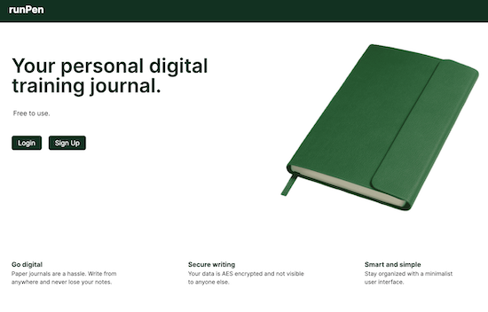

# runPen

A digital training journal on the web for recreational use.<br>
[runpen.ca](www.runpen.ca)



## Tooling

* Vercel for deployment and hosting
* Next.js for the front-end
* Firebase for authentication
* Express.js for the server
* MongoDB for the database

## Installation
The project is hosted for actual use at www.runpen.ca. 

To develop locally, build the client Docker image from the included Dockerfile.
````
docker build -t runpen-client .
docker run -p 3000:3000 runpen-client
````

Note that to have the full stack application running, the server and database implementations are required. A docker compose has not yet been written for this.
* The server is https://github.com/dgutkin/runpen-server
* The database is MongoDB (https://www.mongodb.com/docs/manual/administration/install-community/)

## License

MIT License
